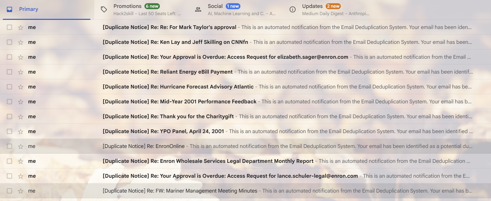
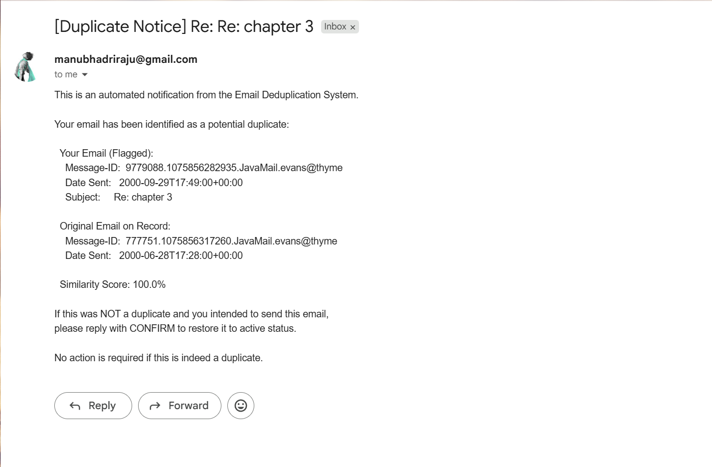

# AI Tool Usage Documentation

---

## Tool Used

- **Tool:** Claude Code
- **Model:** claude-sonnet-4.6

---

## Prompting Strategy

I gave Claude the full spec at the start, then worked task by task. For each task I'd paste the relevant spec section and ask for a plan before any code was written. This helped because Claude would catch spec details I might have glossed over if I just described the task in my own words.

One habit I developed early: before accepting any design decision, I'd ask "what are the tradeoffs?" or push back on the first approach. This saved significant rework; the Task 3 approach changed completely because I questioned it before implementation.

exact prompt I gave at the beginning:

```
I'm building an end-to-end email data extraction pipeline for a take-home assignment.
Here is the full specification: @Round 2b - Take Home Assignment (claude) (1).docx

Before writing any code, do the following:
  - Create the complete project folder structure with all files and folders the spec requires
  - Add placeholder comments in each file explaining what goes there

Dataset is at: @enron_mail_20150507\maildir
Selected mailboxes: kaminski-v, dasovich-j, kean-s, taylor-m, haedicke-m
Do NOT write any pipeline code yet. Just the structure.

Also verify if the selected 5 mailboxes is a good selection or not.
```
Note: initially I started with the above emailbox selection and the pipeline ran perfectly but took 30min as it has 78k files to process. For live demo purposes I changed the emailbox selection a bit.
---

### Example Prompts

**1. Planning Task 4 from the spec**
> " *(pasted the full spec section 4 text)* re read this and layout a plan for task 4 and ask me clarifying questions instead of assuming. Do not hallucinate" 

Rather than summarising what I wanted, I pasted the exact spec text and asked Claude to re-read it and layout a plan by asking clarifying questions. This way the plan came from the actual requirements, not my paraphrasing.

**2. Questioning a design decision before coding**
> "but will truncating the body context maintain integrity? what are the tradeoffs?"

Claude's first approach for duplicate detection was to truncate email bodies to 2000 characters before fuzzy matching. I pushed back before any code was written. The answer revealed that truncation could cause false positives for emails where the meaningful content comes after the cutoff so we switched approaches entirely.

**3. Guiding a fix when something wasn't working**
> "Instead of continuing this, could we use some kind of hashing technique - or should we replace the mailbox? Our main goal is to demonstrate the duplicate mail-sending pipeline"

Task 3 was hanging. Rather than keep patching the same approach, I stepped back and proposed two changes at once: switch to a hashing + fuzzy matching strategy for detecting duplicates, and replace the problematic mailbox. Both turned out to be necessary as kean-s belonged to a massive newsletter group that was overwhelming the pipeline, so swapping it out with skilling-j removed the bottleneck, while the hashing + fuzzy approach handled the duplicate detection more efficiently. Together, the two changes fixed the task cleanly.

**4. Asking for readable code**
> "okay, comment it well so I can understand the flow. notify me after it is completed"

The MCP integration in notifier.py is the most complex part of the pipeline - Claude calling a tool, getting a result, confirming success. I asked for clear inline comments throughout so I could follow what was happening at each step.

---

## Iterations & Debugging

### Case 1 - Task 3: Pipeline kept hanging for over an hour

**Issue:** The initial approach ran pairwise fuzzy comparisons (fuzz.ratio) across all candidate email groups. This sounds fine until I looked at the actual data. kean-s had a newsletter group called "Energy Issues" with 293 emails — that's 293×292/2 = 42,000 comparisons for one group alone. The process ran for over an hour and had to be killed multiple times.
**refining the prompt:** I stopped the run and asked Claude to diagnose which groups were causing the slowdown before touching any code. Once the newsletter groups were identified, I prompted *"which email box is the most problematic?"* to identify the bottleneck, then asked *"instead of running all comparisons, what if we use hashing to group exact duplicates first?"* to propose the hash-first approach. Once confirmed, I followed up with *"Instead of continuing this, could we use some kind of hashing technique - or should we replace the mailbox? Our main goal is to demonstrate the duplicate mail-sending pipeline"* .

**Fix:** Switched to a hash-first approach. SHA-256 hash the normalised body first. Emails with identical bodies collapse instantly to a single representative. Then fuzzy matching only runs between representatives, not all 293 members. A 293-email newsletter group with mostly identical bodies reduced to 1-3 comparisons. Also replaced kean-s with skilling-j to remove the problematic newsletter group entirely. 

### Case 2 - MCP server: two wrong servers installed before the right one

**Issue:** First tried `mcp-gmail` (a Python package) — failed immediately on import with `TypeError: Too few arguments for typing.Dict`. This is a known incompatibility with Python 3.14's stricter type checking, not something fixable without patching the upstream library.

Switched to the GongRzhe Node.js server (`@gongrzhe/server-gmail-mcp`), which started but ran in "stateless mode" — it printed instructions for passing a Bearer token manually rather than doing the OAuth flow. It had found no credentials.json.

**Fix:** Uninstalled the stateless variant, installed the correct autoauth package, added Gmail address as a test user in Google Cloud Console under OAuth consent screen -> Test users.

### Case 3 - Header type error silently failing 6% of emails

**Issue:** When switching to a new set of mailboxes for the demo run, I noticed repeated warnings in the output: `ProgrammingError: Error binding parameter 8: type 'Header' is not supported`. 1,596 out of 26,496 files were failing silently — they were being logged as errors and skipped without being stored in the database.

The bug was in `utils/email_parser.py`. The X-* headers (X-From, X-To, X-cc, X-bcc, X-Folder, X-Origin) were being passed directly from `msg.get()` to SQLite. In some emails, `msg.get()` returns an `email.header.Header` object instead of a plain string — SQLite can't bind that type, so the insert fails.

**Refining the prompt:** I realised that the X-* fields were the only header fields in `_extract_optional()` not going through `_decode_header_value()`, which already existed in the file and handles the Header to string conversion. Every other header field was already using it correctly.

**Fix:** So I wrapped all six X-* headers and `content_type` in `_decode_header_value()` — a one-line change per field. The function was already there but wasn't being applied consistently.

### Case 4 - False positives in duplicate notifications

**What went wrong:** After the first successful live run, some emails showed similarity scores of 66.9% and 84.7% in the notifications which were well below the 90% threshold. When I found this and checked, the explanation was Union-Find transitivity: if A~B (>=90%) and B~C (≥90%), Union-Find puts A, B, C in the same cluster even if A~C only scores 66.9%.

That's not a duplicate under the given definition. The given document says "body similarity >= 90%". A 66.9% score against the original is too ambiguous to flag with confidence.

**Refining prompt:** I flagged the specific email and score to Claude and asked directly: *"why is this a duplicate when score is 66%? what is the expected output?"* This forced a clear answer. It confirmed the email should not be flagged, explained why Union-Find caused it, and proposed the strict pairwise filter as a fix.

**Fix:** Added a strict pairwise filter - after clustering, any email whose direct score against the original is below 90% gets dropped, even if Union-Find pulled it into the cluster via a chain. Also added a DB clear step at the start of Task 3 so old stale flags don't persist across re-runs.

---

## What I Wrote vs. What AI Wrote

| File | Who wrote it |
|---|---|
| config.py | AI gave the template and I wrote the code |
| utils/email_parser.py | AI coded it and I tested edge cases and confirmed mandatory field handling |
| utils/date_utils.py | AI |
| pipeline/extractor.py | AI |
| pipeline/storage.py | AI |
| pipeline/deduplicator.py | AI coded it and I identified the performance issue, guided the hash+fuzzy approach, and caught the false positive bug |
| pipeline/notifier.py | AI coded it and I reviewed the MCP agentic loop carefully |
| schema.sql | AI |
| sample_queries.sql | I wrote the queries and verified results in DB Browser |
| MCP setup (Google Cloud, OAuth, auth) | I did this entirely |
| Mailbox selection | I chose and justified all 5, and replaced kean-s with skilling-j |
| README.md | AI gave the template and I filled in the content section by section |
| AI_USAGE.md | AI gave the template and I wrote the content |

**Overall estimate:** ~70% AI-generated code, ~30% guided, debugged, optimised, chose better approaches, and manually written.

---

## MCP Integration

### MCP Server Choice

Used `@gongrzhe/server-gmail-autoauth-mcp` - a Node.js Gmail MCP server. Chose it because:

- The Python alternative (`mcp-gmail`) was incompatible with Python 3.14 on import
- The autoauth variant handles token storage automatically after a one-time browser-based auth - no manual token management needed on every run
- It exposes a `send_email` tool that Claude can call directly, which is exactly what the spec asks for

### Step-by-Step Setup

See the MCP Setup section in README.md for the full walkthrough. Key steps: create Google Cloud project, enable Gmail API, create OAuth 2.0 credentials (Desktop app), add Gmail address as test user, install the npm package, run the auth command, token stored automatically.

### How Claude Uses the MCP Tool

In live mode, the pipeline builds a notification for each duplicate group and sends Claude a prompt like this:

```
Send a notification email using the send_email tool with the following details:

To: manubhadriraju@gmail.com
Subject: [Duplicate Notice] Re: Mid-Year 2000 Performance Feedback

Body:
This is an automated notification from the Email Deduplication System.
Your email has been identified as a potential duplicate:
  ...
  Similarity Score: 94.2%
  ...

Use the send_email tool to send this email now.
```

Claude responds with a `tool_use` block. The pipeline executes that tool call on the MCP server, which authenticates with Gmail via the stored OAuth token and delivers the email. Claude then confirms with an `end_turn` response. This loop runs once per duplicate group.

### Issues Encountered

| Issue | Fix |
|---|---|
| `mcp-gmail` TypeError on Python 3.14 | Switched to Node.js-based `@gongrzhe/server-gmail-autoauth-mcp` |
| Installed stateless variant by mistake | Uninstalled `@gongrzhe/server-gmail-mcp`, installed correct autoauth variant |
| OAuth "Access blocked" error | Added Gmail address as test user in Google Cloud Console -> OAuth consent screen |
| Enron sender addresses are defunct | Added `NOTIFICATION_OVERRIDE_EMAIL` env var to redirect all notifications to own Gmail |
| False positive emails (66.9% score) flagged and notified due to transient connections in union find| Added strict pairwise filter in deduplicator — only emails scoring ≥90% directly against original are flagged |

### Evidence of Successful Send

Live mode confirmed working - 15 notification emails arrived in Gmail inbox with correct subjects, message IDs, dates, and similarity scores matching the duplicates_report.csv entries.

Screenshot 1 - Gmail inbox showing 15 [Duplicate Notice] emails received:



Screenshot 2 - Example notification email:



---

## Lessons Learned

The biggest thing: ask "what are the tradeoffs?" before accepting a design. The truncation approach for Task 3 sounded reasonable until I asked - then it was obvious it could miss duplicates and flag false positives. That one question saved a lot of rework.

Data analysis and selection decisions are something we have to own ourselves. Choosing the right mailboxes wasn't just picking five names — it meant looking at actual email counts, understanding which mailboxes would produce meaningful duplicates, diagnosing why kean-s was bottlenecking the pipeline, and making the call to swap it out. AI can suggest options and explain tradeoffs, but the judgment call of what actually makes sense for the problem at hand has to come from us. Same with MCP setup — Claude can walk through the steps, but creating a Google Cloud project, enabling APIs, setting up OAuth credentials, and adding test users all require hands-on decisions that can't be delegated.

The agentic loop (Claude -> tool_use -> MCP -> tool_result -> Claude) is simpler than it sounds once we see it working end-to-end. But understanding what MCP actually is, what OAuth does, and how the loop flows - before touching any code - made it much easier to debug when the server started in stateless mode instead of doing the auth flow.

AI is very good at structure and template. Where it needed more guidance was in edge cases specific to this dataset - the Windows trailing-dot filename issue in the Enron maildir, the newsletter group bottleneck, the Union-Find transitivity false positives. Those all required either catching the problem myself and fixing or knowing the right question to ask.
